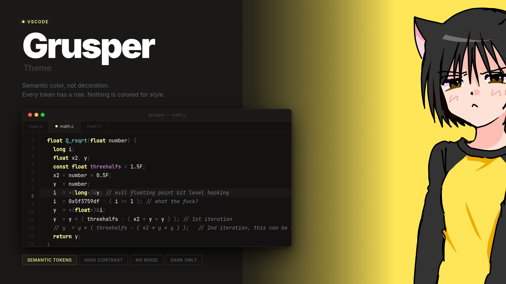

# Grusper VSCode theme

Grusper is a dark theme for readability, semantic meaning, and high contrast.

## Feedback & Issues

If you find any bugs or have suggestions for improvements, please feel free to open an issue in the repository.
